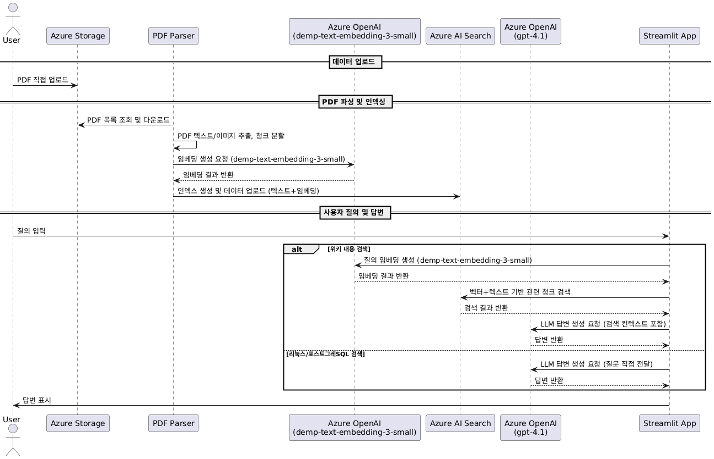

# 에어맵 운영 Q&A

## 프로젝트 개요
 > 1. 서비스 운영하면서 과거에 유사한 케이스로 작성해 놓은 내용, 과거에 언제 뭐때문에 배포했는지 기억안나는 내용들때문에 위키 검색을 해보아도 잘 찾을수가 없다.
 > 2. 리눅스서버 운영이나 PostgreSQL 운영 관련 내용은 늘 구글링 한다.
 
이런 어려움을 이번 챗봇 에이전트 생성을 통해 해소해 보고자 함.

## 단게별 작업 설명
- Concluence에서 위키 페이지를 pdf로 다운로드
   * 크롤링시도하였으나 로그인 세션 생성에서 실패.
   * 사이트 전체를 html로 다운로드 하였으나 불필요하고 반복적인 tag가 너무 많아서 실패.
   * 용량이 너무 커서 위키페이지의 카테고리별로 샘플링하여 pdf로 다운로드하기로 결정.
   * 하위 페이지를 포함하여 pdf로 생성하였더니 pdf 파일도 너무 커져서 페이지 단위로 pdf로 생성하기로 결정.
   * markdown 양식으로 정리하기 용이하게 pdf로 다운로드 완료.  

- Confluence 내용을 다운로드한 pdf를 파싱하여 markdown 파일 생성
   * PyMuPDF로 pdf 내용을 파싱한후, chatgpt로 markdown양식으로 정리한 파일 생성 (parse_pdf_dir.py)
   * pdf 파일이 큰경우 md로 생성하면서 자꾸 요약하고 생략해서 pdf 파일을 페이지 단위로 그룹핑해서 md 파일로 생성하도록 별도 스크립트 작성 (parse_pdf_pages.py)

- 생성된 markdown 파일을 Azure Storage에 저장
- Azure AI Search에서 demp-text-embedding-3-small 모델로 Chungking & Embedding 진행
- Azure AI Search와 Azure OpenAI를 이용하여 콘솔 프롬프트 질문에 대한 답변 생성하는 스크립트 작성히여 접속정보 환경설정 점검 및 데이터 확인 수행.
- Streamlit을 이용하여 웹 UI로 Q&A 챗봇 앱 스크립트 작성.
- Streamlit 앱을 Azure App Service로 배포. 
- https://user15-demoweb-a7drcgfyhabpevf8.eastus2-01.azurewebsites.net/ 접속하여 내용 확인.

## 주요 기능

- **주제별 질문 라우팅**:
    - 리눅스, PostgreSQL, 위키 관련 질문을 자동 분류하여 최적의 답변 경로로 안내
- **RAG 기반 답변**:
    - Azure AI Search와 OpenAI를 활용한 위키 문서 검색 및 답변 생성
- **전문가 답변**:
    - 리눅스, PostgreSQL 질문에 대해 전문가 수준의 답변 및 코드 예시 제공
- **Streamlit 기반 UI**:
    - 간편한 웹 인터페이스 제공

## 설치 및 실행 방법

1. **필수 패키지 설치**

```bash
pip install streamlit python-dotenv openai azure-search-documents
```

2. **환경 변수 설정**
    - 프로젝트 루트에 `.env` 파일을 생성하고 아래 환경 변수를 입력하세요.

```
# Azure OpenAI (RAG 및 임베딩용)
AZURE_OPENAI_API_KEY=your_openai_api_key
AZURE_OPENAI_ENDPOINT=your_openai_endpoint
AZURE_OPENAI_EMBBEDING_MODEL_NAME=your_embedding_model_name
AZURE_OPENAI_EMBBEDING_DEPLOYMENT_NAME=your_embedding_deployment_name
AZURE_OPENAI_EMBBEDING_API_VERSION=your_embedding_api_version
# Azure OpenAI (오픈 검색용)
AZURE_OPENAI_CHAT_MODEL_NAME=your_chat_model_name
AZURE_OPENAI_CHAT_DEPLOYMENT_NAME=your_chat_deployment_name
AZURE_OPENAI_CHAT_API_VERSION=your_chat_api_version

# Azure AI Search (RAG 검색용)
AZURE_SEARCH_SERVICE_ENDPOINT=your_search_service_endpoint
AZURE_SEARCH_INDEX_NAME=your_search_index_name
AZURE_SEARCH_API_KEY=your_search_api_key

# Azure Storage (md 저장용)
AZURE_STORAGE_CONNECTION_STRING=your_storage_connection_string
AZURE_STORAGE_CONTAINER_NAME=your_storage_container_name
```

3. **앱 실행**

```bash
streamlit run airmapqna-app.py
```
## 파일 구조

|파일명|설명|
|---|:---|
| airmapqna-app.py | 메인 Streamlit 앱 코드 |
| .env | 환경 변수 파일 (직접 생성 필요) |

## 주요 코드 설명

- **클라이언트 초기화**:
Azure OpenAI 및 Azure AI Search 클라이언트 객체를 초기화하고 캐시하여 사용합니다.
- **질문 라우팅**:
질문 내용에 따라 리눅스, PostgreSQL, 위키로 분기하여 처리합니다.
- **RAG 답변 생성**:
위키 관련 질문은 임베딩 및 벡터 검색을 통해 관련 문서를 찾고, LLM을 이용해 답변을 생성합니다.
- **전문가 답변 생성**:
리눅스/포스트그레SQL 질문은 전문가 프롬프트를 사용해 답변을 생성합니다.
- **Streamlit UI**:
간단한 웹 UI를 통해 질문 입력 및 답변 확인이 가능합니다.



## 사용 예시

1. **리눅스 명령어 관련 질문**
    - 예: `리눅스에서 파일 권한 변경 방법 알려줘`
2. **PostgreSQL 튜닝 질문**
    - 예: `PostgreSQL 인덱스 최적화 방법은?`
3. **사내 위키 정보 검색**
    - 예: `에어맵 시스템 구조 설명해줘`
